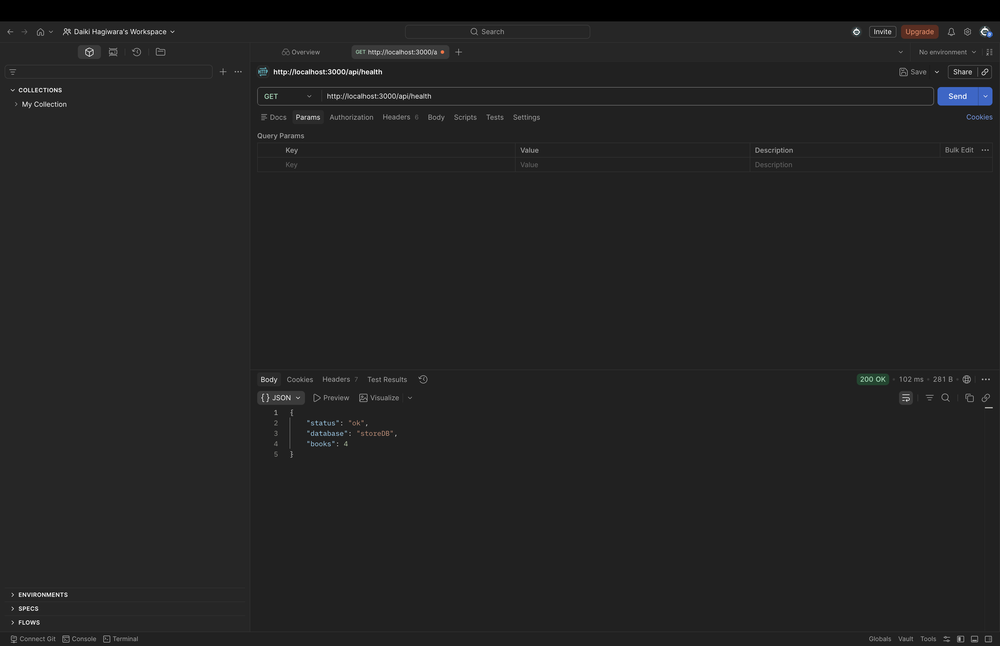
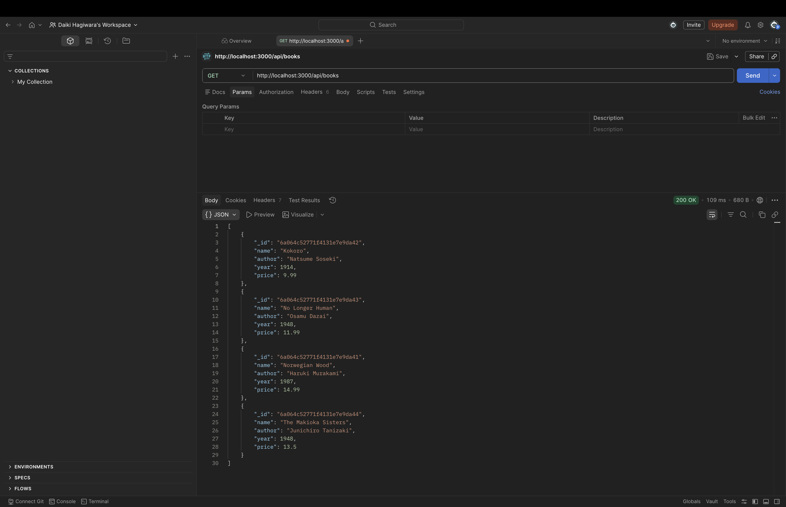
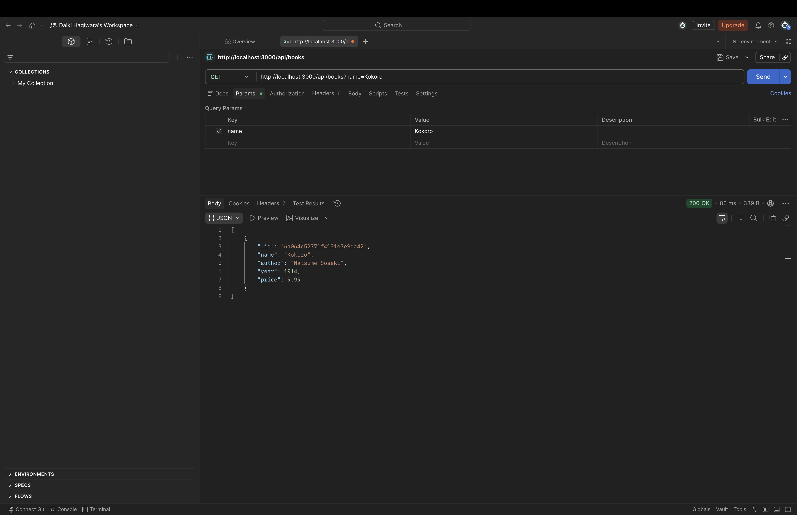
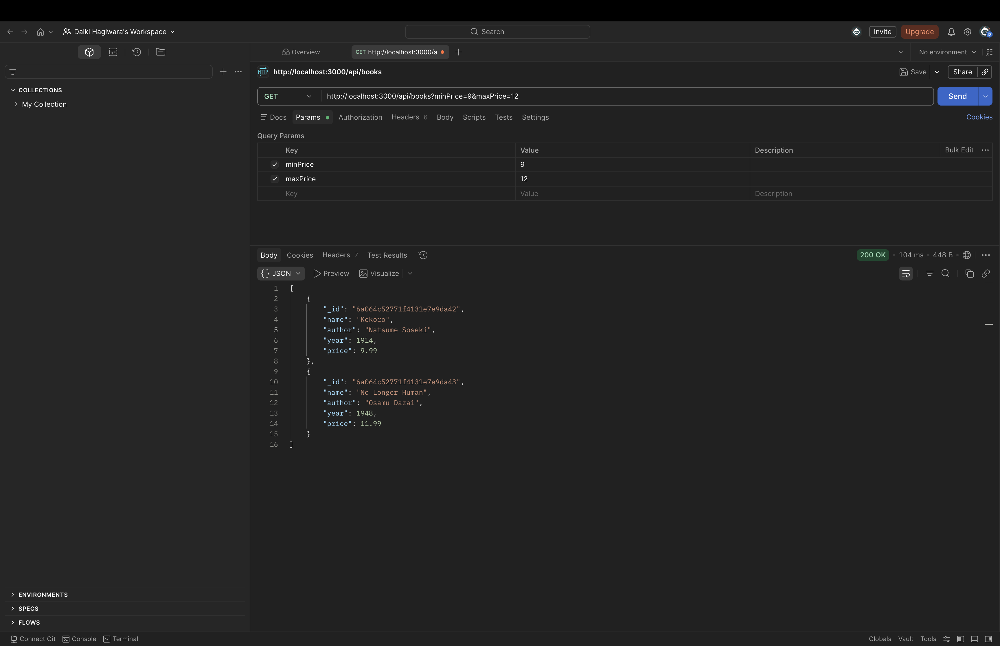
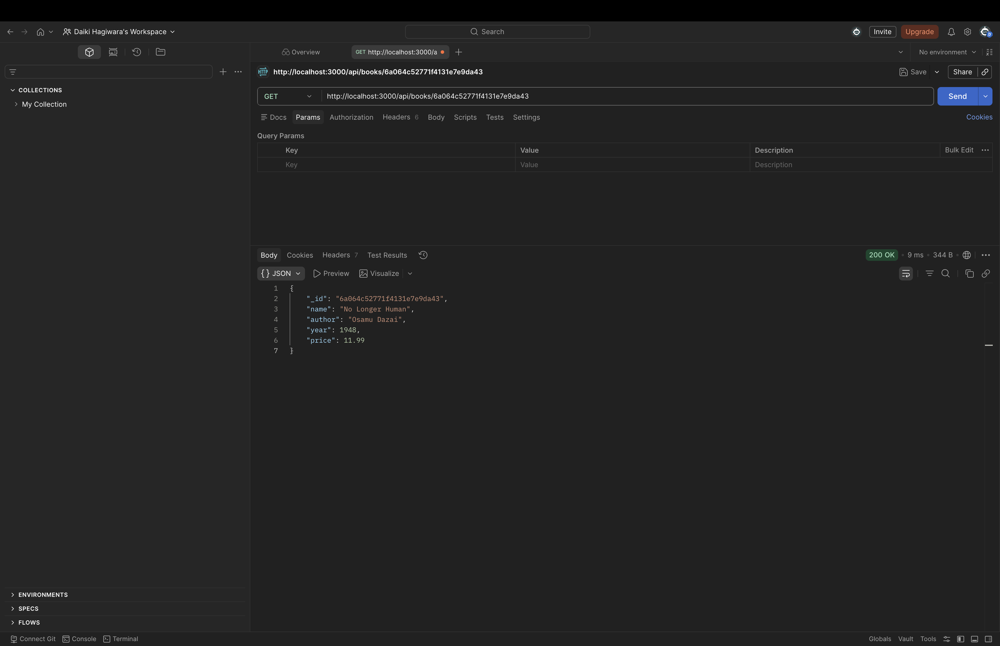
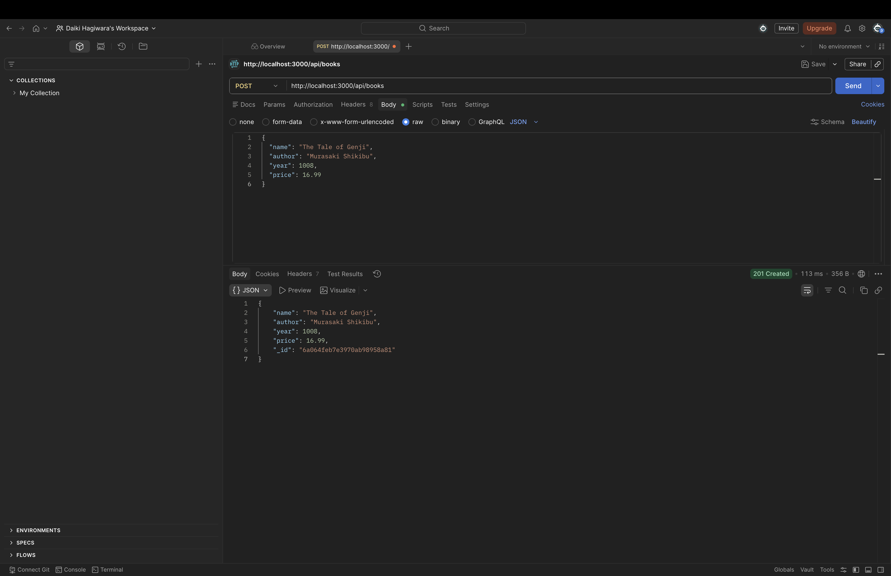
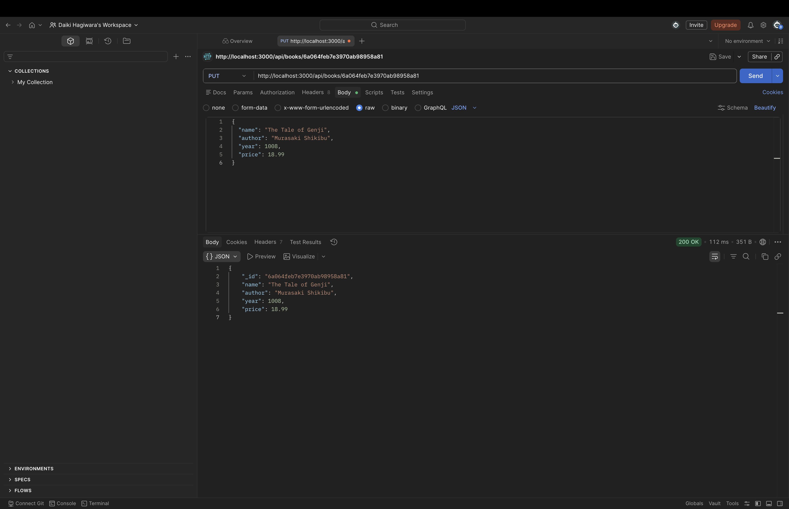
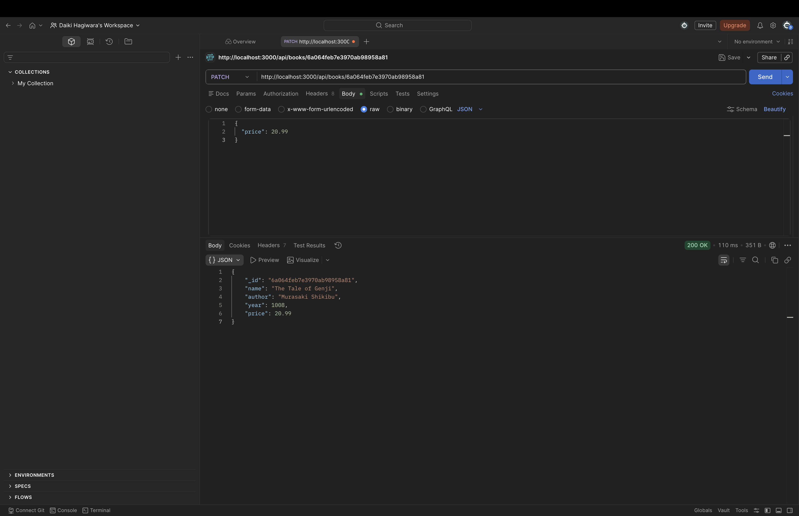
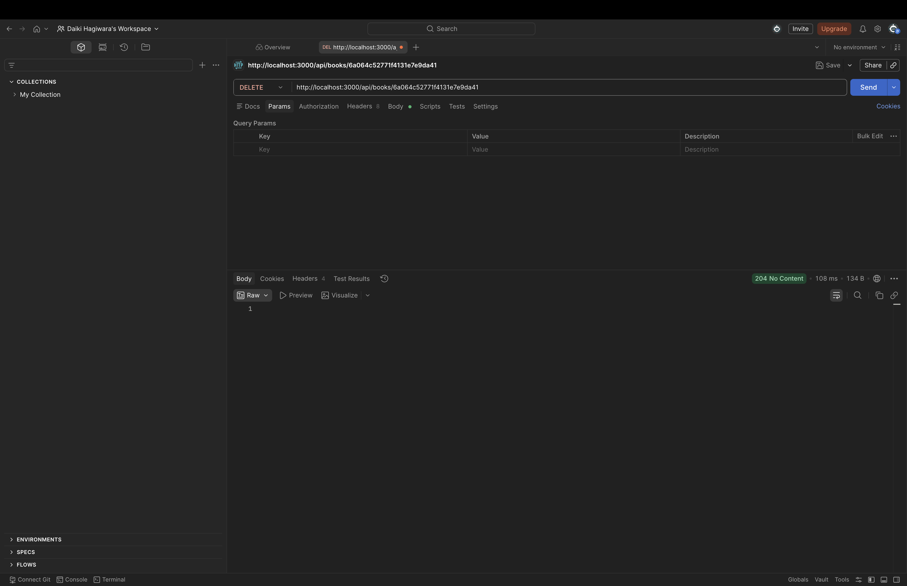
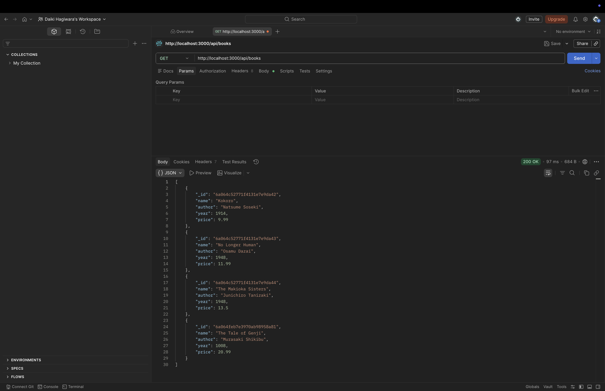

## Questions
1. What is the purpose of using `.env`
  - A .env file is used to store configuration values outside of the source code.
  - Change settings without editing code
  - Keep database URLs, API keys, and secrets out of the code

---

2. How does this work:
```js
if (query.minPrice || query.maxPrice) {
    filter.price = {};
    if (query.minPrice) filter.price.$gte = Number(query.minPrice);
    if (query.maxPrice) filter.price.$lte = Number(query.maxPrice);
}
```
Example URL:
```text
/products?minPrice=10&maxPrice=50
```
Then:
```text
query.minPrice = "10"
query.maxPrice = "50"
```

The code makes:
```js
filter = {
    price: {
        $gte: 10,
        $lte: 50
    }
}
```
Meaning: Find products where price is greater than or equal to 10 and less than or equal to 50.

---

3. What is the program `seed.js` used for?
  - seed.js is used to reset and fill the database with sample product data.
  - It connects to the database, deletes all existing products from the collection, inserts the products from products.js, and then prints how many products were inserted. If an error happens, it displays the error. Finally, it closes the database connection.

---

4. Try all API routes using Postman
  - I did.

---

5. In terms of code what is the difference between `put` and `patch`
  - In code, PUT replaces the whole product, but PATCH updates only the fields you send.

---

## Screenshots of API Routes

### 1. GET `/api/health`

This screenshot shows the API health check route.



---

### 2. GET `/api/books`

This screenshot shows the route for listing all books.



---

### 3. GET `/api/books?name=...`

This screenshot shows the route for filtering books by author.



---

### 4. GET `/api/books?minPrice=...&maxPrice=...`

This screenshot shows the route for filtering books by price range.



---

### 5. GET `/api/books/:id`

This screenshot shows the route for getting one book by ID.



---

### 6. POST `/api/books`

This screenshot shows the route for creating a new book.



---

### 7. PUT `/api/books/:id`

This screenshot shows the route for replacing a whole book.



---

### 8. PATCH `/api/books/:id`

This screenshot shows the route for partially updating a book.



---

### 9. DELETE `/api/books/:id`

This screenshot shows the route for deleting a book.



---
### 10. GET `/api/books` Final Check

This screenshot confirms that POST, PUT, PATCH, and DELETE worked correctly.



